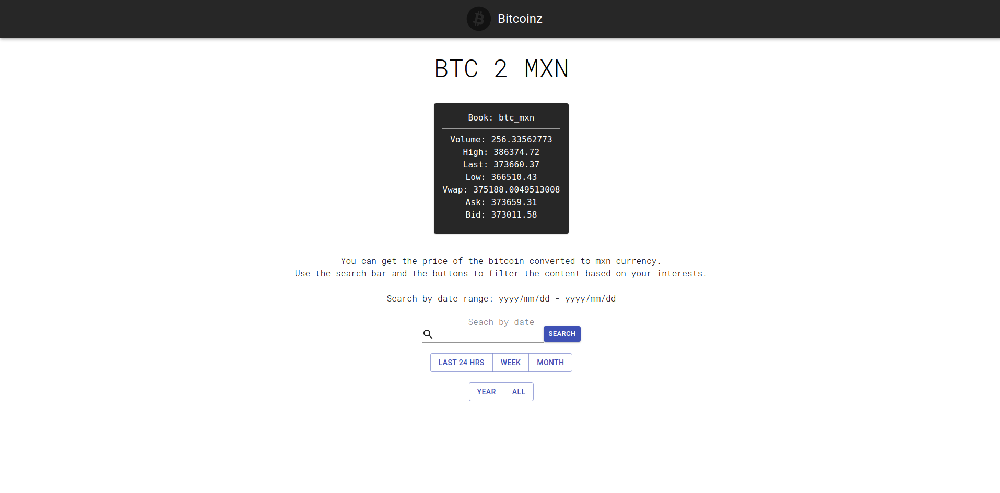
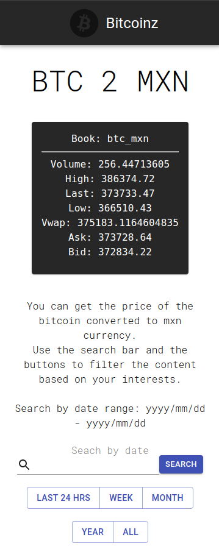
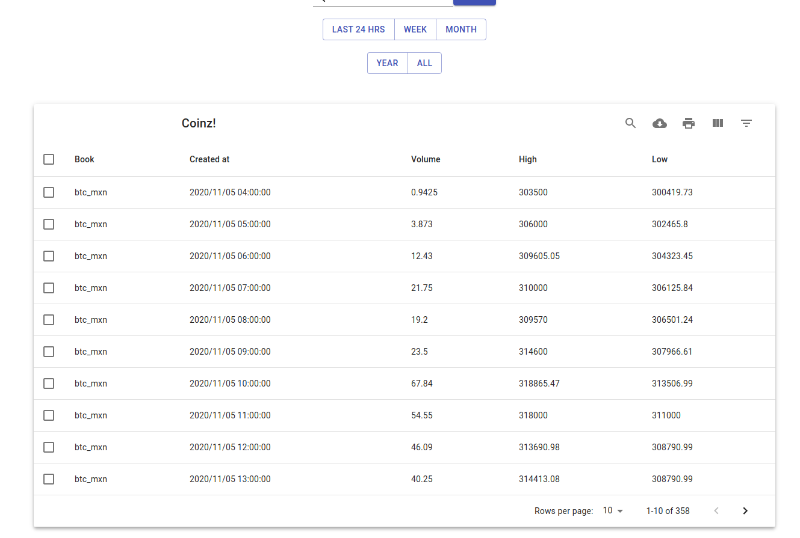
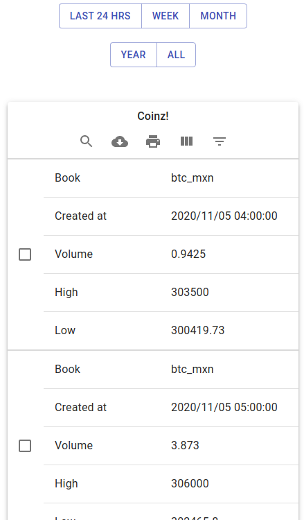
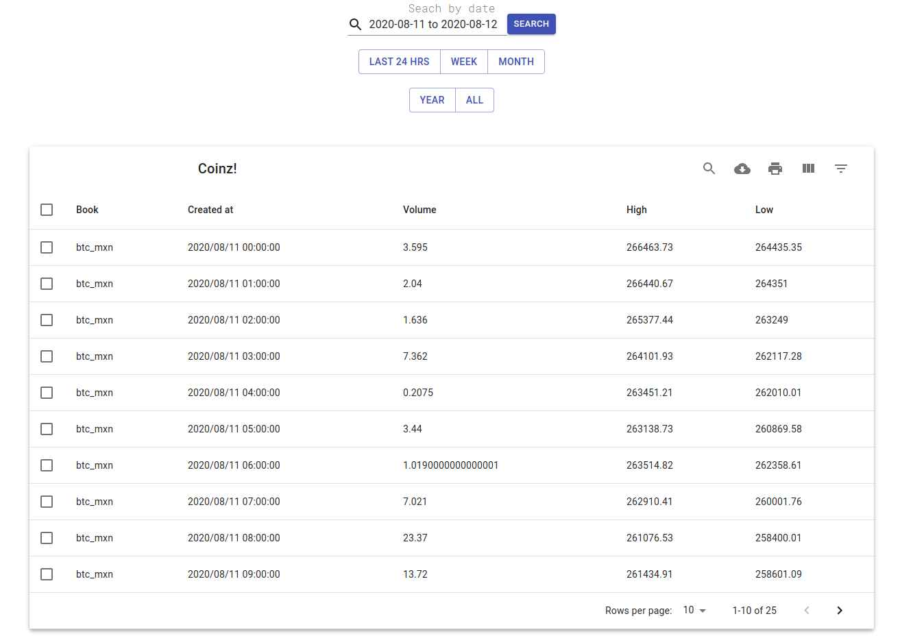
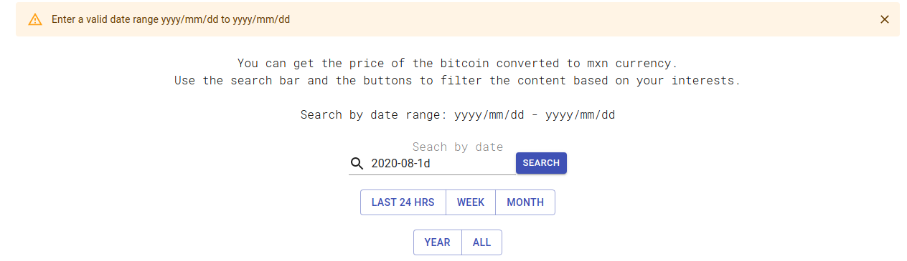

# Front end coinz

This react app was created using __yarn__ as the main package manager.


## What I used

+ React.js: front end framework
+ Material-UI: css framework
+ axios: http requests
+ Yarn: node package manager


## What I did

Fetch data from the django server via the endpoints of the REST API using event listeners (onClick) on 
buttons that when clicked a http GET request is performed with axios.

The calls are done in an async way to keep running code and listening for events while the data is still being fetched.

The application is _responsive_, an easy thing to do with Material-UI.

## React features 

+ functional components (React Hooks)
  + useState: a state variable that can be updated as the user interacts with the ui
  + useEffect: execute code when a component is first loaded
+ datatables to display and paginate the requested data

## How to install it?

**Make sure to first start the django server to avoid an API call error**

Clone the repository:
```sh
$ git clone https://github.com/daniel-sjkdm/FrontEndCapptu.git
```

Install the dependencies:
```sh
$ yarn install
```

Run the server:
```sh
$ yarn run
```


## How it looks











